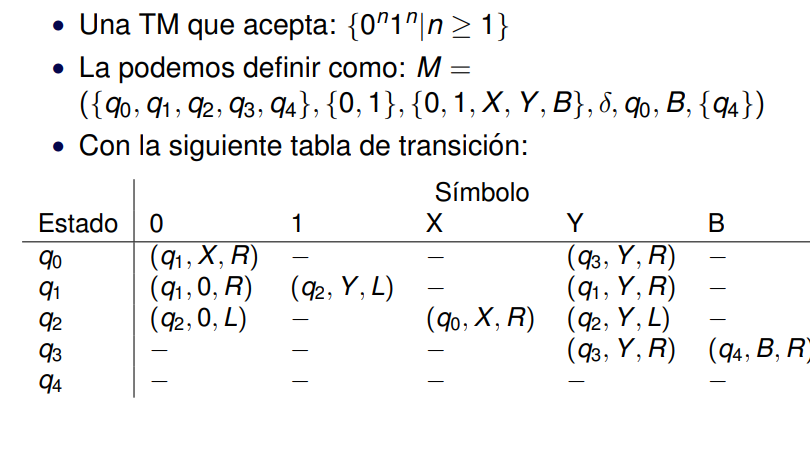

# maquinas-turing
Maquinas de Turing - Teoria de la computacion

## set-up docker

run  docker network create db

docker run --name db -p 5432:5432 --network=db -v "$PWD:/var/lib/postgresql/data" -e POSTGRES_PASSWORD=password -d postgres:alpine

## Ejemplos para la maquina de turing:

### Aceptar cadenas

### Es Palindormo
Identifica si una cadena es palindromo. Es decir *w = w^r*

### Inversion de colores
invierte los colores dado un input

### Ordenamiento de binarios

Ordena los numeros de manera tal que los ceros esten al comienzo y los unos al final.

### Resta en notacion unitaria
Resuelve la resta unitaria

